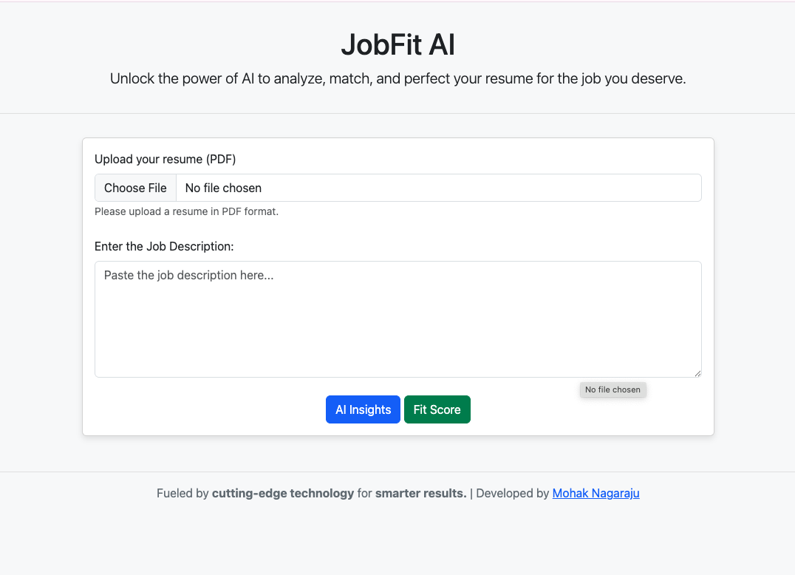
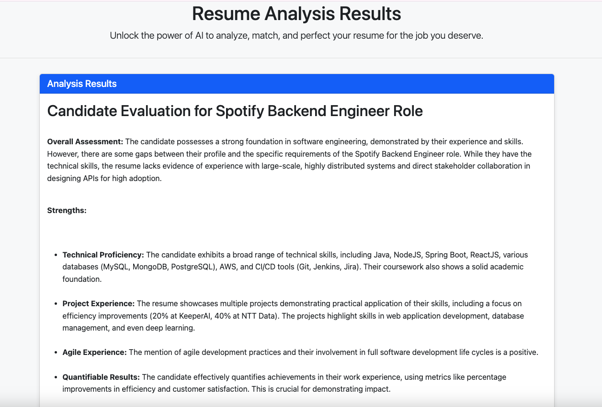
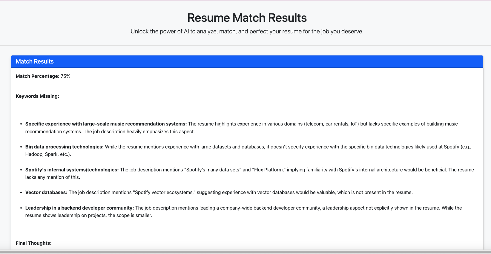

# JobFit AI - Resume Analyzer

JobFit AI is a Spring Boot application that uses Google's Gemini AI to analyze resumes against job descriptions. The application extracts text from PDF resumes, then uses AI to provide insights and match scores to help job seekers improve their applications.

## Features

- **PDF Text Extraction**: Extracts text from uploaded resume PDFs using Apache PDFBox with OCR fallback via Tesseract
- **AI Resume Analysis**: Analyzes resume content against job descriptions to provide professional feedback
- **Match Scoring**: Calculates a match percentage between a resume and job description
- **Responsive UI**: Clean, bootstrap-based interface that works on all devices

## Screenshots

### Home Page

*Upload your resume and job description here*

### Analysis Results

*Get detailed AI-powered insights about your resume*

### Match Score

*See how well your resume matches a specific job description*

## Prerequisites

- JDK 11 or newer
- Maven
- Google Gemini API key
- Tesseract OCR installed on your system (optional, for enhanced PDF processing)

## Installation

### 1. Clone the repository
```bash
git clone https://github.com/Mohak-Nagaraju/AI-Resume-Analyzer.git
cd AI-Resume-Analyzer
```

### 2. Configure Gemini API Key
Edit `src/main/resources/application.properties` and add your Gemini API key:
```properties
gemini.api.key=YOUR_GEMINI_API_KEY_HERE
```

Alternatively, you can set it as an environment variable:
```bash
export GEMINI_API_KEY=your-api-key-here
```

### 3. Configure Tesseract (Optional)
If you want to use OCR capabilities for scanned PDFs:

#### Install Tesseract
- **Windows**: Download from [UB Mannheim](https://github.com/UB-Mannheim/tesseract/wiki)
- **macOS**: `brew install tesseract`
- **Linux**: `sudo apt-get install tesseract-ocr`

Then, uncomment and update the data path in `PDFTextExtractor.java`:
```java
tesseract.setDatapath("/path/to/tessdata");
```

### 4. Build the project
```bash
mvn clean package
```

### 5. Run the application
```bash
java -jar target/demo-0.0.1-SNAPSHOT.jar
```

Or using Maven:
```bash
mvn spring-boot:run
```

## Usage

1. Access the application at `http://localhost:8080`
2. Upload your resume in PDF format
3. Paste the job description you're targeting
4. Choose either:
    - **AI Insights**: For detailed analysis and recommendations
    - **Fit Score**: To see how well your resume matches the job description
5. Review the analysis results and make improvements to your resume

## Project Structure

```
├── src/main/java/com/example/
│   ├── controller/
│   │   └── ResumeController.java
│   ├── service/
│   │   ├── GeminiAIService.java
│   │   └── PDFTextExtractor.java
│   └── ResumeAnalyzerApplication.java
│
├── src/main/resources/
│   ├── templates/
│   │   ├── index.html
│   │   └── result.html
│   └── application.properties
│
└── uploads/  # Temporary storage for uploaded files
```

## Key Components

- **ResumeController**: Handles HTTP requests and file uploads
- **PDFTextExtractor**: Extracts text from PDF files with OCR fallback
- **GeminiAIService**: Communicates with Google's Gemini API for AI analysis

## Customization

### Modifying AI Prompts
You can customize the AI analysis by editing the prompts in `GeminiAIService.java`:

```java
String basePrompt = "You are an experienced Technical Human Resource Manager...";
```

### Changing UI
The frontend uses Thymeleaf templates located in `src/main/resources/templates/`:
- `index.html`: Home page with file upload form
- `result.html`: Results page showing analysis

## Troubleshooting

### PDF Text Extraction Issues
- Ensure Tesseract is properly installed if you're processing scanned PDFs
- Check logs for extraction errors

### API Key Problems
- Verify your Gemini API key is correct and has the necessary permissions
- Ensure the key is properly configured in application.properties or as an environment variable

### Application Won't Start
- Check if port 8080 is already in use (configure a different port in application.properties if needed)
- Ensure Java 11+ is installed and properly configured

## Contributing

Contributions are welcome! Please feel free to submit a Pull Request.

## Acknowledgments

- Built with Spring Boot
- Powered by Google Gemini AI
- Uses Tesseract OCR for enhanced PDF processing
- Developed by [Mohak Nagaraju](https://www.linkedin.com/in/mohaknagaraju/)